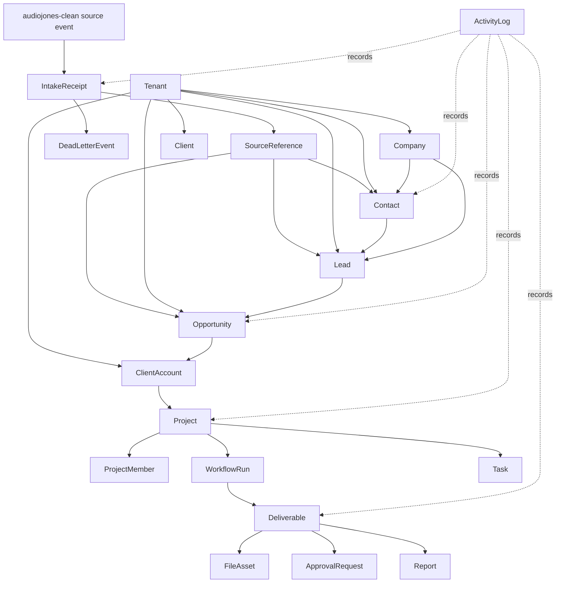

# AJ Digital OS CRM Object Model

**Owner:** AJ Digital OS engineering
**Status:** Architecture contract, documentation only
**Scope:** canonical CRM, opportunity, client, project, workflow, deliverable, reporting, intake, and source-reference objects inside AJ Digital OS
**Last updated:** 2026-07-03

## Decision Summary

AJ Digital OS is the canonical operational control plane for accepted `audiojones-clean` handoffs.

This document defines the internal CRM object model before migrations, endpoints, automation, HubSpot sync, or website wiring. It does not authorize implementation.

Canonical doctrine:

- `audiojones-clean` may request intake.
- AJ Digital OS decides canonical CRM state.
- No website event directly creates a project.
- No orchestration tool becomes source of truth.
- HubSpot is optional external projection only.
- n8n is orchestration only.
- Storage systems store files only; AJ Digital OS owns file metadata and lifecycle references.

## Source Documents And Evidence

Source architecture documents:

- `origin/main:docs/architecture/AUDIOJONES_CLEAN_HANDOFF_CONTRACT.md`
- `origin/main:docs/architecture/AJ_DIGITAL_OS_CRM_SCHEMA_ALIGNMENT.md`
- `origin/main:docs/architecture/AJ_DIGITAL_OS_INTAKE_EVENT_MODEL.md`
- `docs/specs/AJ_DIGITAL_MULTI_TENANT_CRM_MODULE_SPEC.md`
- `docs/specs/AJ_DIGITAL_MULTI_TENANT_CRM_DB_RLS_SPEC.md`
- `docs/integration/PORTAL_OS_INTEGRATION_CONTRACT.md`
- `docs/architecture/deliverable-and-approval-routing-spec.md`
- `docs/architecture/deliverable-approval-lifecycle-spec.md`

Existing schema and runtime surfaces:

- `supabase/migrations/20260626150000_crm_multitenant_rls.sql`
- `sql/supabase-schema.sql`
- `sql/neon-os-schema.sql`
- `src/crm/crm-types.ts`
- `src/crm/crm-service.ts`
- `src/crm/crm-store.ts`
- `src/crm/postgres-crm-store.ts`
- `src/crm/persistent-crm-store.ts`
- `src/types/deliverable.types.ts`
- `src/core/deliverable-store.ts`
- `src/services/runtime/deliverable-lifecycle.ts`

## Non-Goals

- Do not create migrations.
- Do not create endpoints.
- Do not wire `audiojones-clean`.
- Do not wire HubSpot.
- Do not wire n8n.
- Do not create a new website-side CRM.
- Do not create a new project table until the project boundary is approved.
- Do not move deliverable files or storage objects.
- Do not commit secrets, client exports, production payloads, or private deliverables.

## Object Model Overview



## Object Classification

| Object | Classification | Current support | Canonical decision |
| --- | --- | --- | --- |
| Tenant | Existing canonical | `crm_tenants`, tenant context, RLS | Keep as CRM isolation boundary |
| Contact | Existing canonical | `crm_contacts`, service/store support | Keep as OS CRM contact truth |
| Company | Existing partial | `crm_companies`, type support | Add service/store support before intake company mapping |
| Lead | Existing canonical | `crm_leads`, service/store support | Keep as OS CRM lead truth |
| Opportunity | Existing canonical | `crm_opportunities`, service/store support | Keep as OS commercial opportunity truth |
| Client | Existing partial | `clients` table | Keep as operational customer/account base, but align with CRM tenant |
| ClientAccount | Logical bridge | No final object found | Define bridge from won opportunity to client operations |
| Project | Boundary open | `missions`, portal project projection, future table open | Do not implement new project table yet |
| ProjectMember | Future logical | No final object found | Define after project boundary is approved |
| WorkflowRun | Existing partial | `mission_runs`, `dag_runs`, runtime run records | Use as execution run, not CRM truth |
| Task | Existing partial | `crm_tasks` table | Extend service support before automation |
| Deliverable | Existing partial | `deliverables`, deliverable lifecycle service | Keep as operational artifact metadata |
| FileAsset | Existing partial | `assets`, storage keys, R2 surfaces | Keep as storage metadata, not file truth |
| ApprovalRequest | Existing partial | `approvals`, `crm_approval_refs`, deliverable approval lifecycle | Keep as approval/workflow gate |
| Report | Logical projection | deliverables and report-ready doctrine | Model as generated reporting artifact or projection |
| ActivityLog | Existing partial | `crm_audit_events`, file/runtime audit | Normalize audit semantics before intake endpoint |
| IntakeReceipt | Required missing | no dedicated website intake receipt found | Add before website handoff endpoint |
| DeadLetterEvent | Required missing | no dedicated dead-letter store found | Add before website handoff endpoint |
| SourceReference | Required missing/partial | metadata exists but no typed source-ref model | Add explicit source-reference model |

## Ownership Boundaries

| Boundary | Canonical owner | Notes |
| --- | --- | --- |
| Public website lead source | `audiojones-clean` | Website owns source capture and diagnostic snapshots |
| Intake acceptance decision | AJ Digital OS | OS validates, dedupes, dead-letters, or accepts |
| CRM relationship state | AJ Digital OS | HubSpot is not canonical |
| Opportunity/commercial state | AJ Digital OS | Created only through OS service contracts |
| Client/account state | AJ Digital OS | Created after approved conversion boundary |
| Project/onboarding state | AJ Digital OS | Website events cannot create directly |
| Workflow execution | AJ Digital OS | n8n may orchestrate but cannot own truth |
| Deliverable metadata | AJ Digital OS | Storage provider owns bytes only |
| Reporting views | AJ Digital OS or approved read model | Metabase reads approved projections |
| External CRM refs | AJ Digital OS | HubSpot IDs may be stored as external refs later |

## Creation Authority Matrix

| Object | Website event may request | AJ Digital OS may create/link | n8n may create | HubSpot may create | Human approval required |
| --- | --- | --- | --- | --- | --- |
| Tenant | No | Yes, by admin path only | No | No | Yes |
| Contact | Yes | Yes | No | No | When ambiguous or suppressed |
| Company | Yes | Yes, after service support exists | No | No | When ambiguous |
| Lead | Yes | Yes | No | No | When consent or tenant is ambiguous |
| Opportunity | Yes | Yes, if qualification rules pass | No | No | When score/routing is ambiguous |
| Client | No | Yes, after conversion boundary | No | No | Yes |
| ClientAccount | No | Yes, after conversion boundary | No | No | Yes |
| Project | No | Yes, after project boundary approval | No | No | Yes |
| ProjectMember | No | Yes | No | No | Usually |
| WorkflowRun | No | Yes | May trigger through OS-approved contract | No | Depends on workflow risk |
| Task | Yes | Yes | May request through OS-approved contract | No | Depends on task type |
| Deliverable | No | Yes | May trigger through OS-approved contract | No | Depends on approval policy |
| FileAsset | No | Yes | May upload only through OS-approved storage policy | No | Depends on file sensitivity |
| ApprovalRequest | No | Yes | May notify only | No | Yes |
| Report | No | Yes | May trigger generation only through OS | No | Depends on audience |
| ActivityLog | No | Yes | No | No | No |
| IntakeReceipt | Yes | Yes | No | No | No |
| DeadLetterEvent | No | Yes | No | No | Review required |
| SourceReference | Yes | Yes | No | No | No |

## Canonical Objects

### Tenant

**Purpose:** tenant-scoped isolation boundary for CRM and operational records.

**Existing support:** `crm_tenants`, `crm_tenant_memberships`, `crm_tenant_settings`, `crm_tenant_module_flags`, tenant context helpers, and RLS policy scaffolding.

**Identity:** `tenantId`.

**Relationships:**

- Owns CRM contacts, companies, leads, opportunities, tasks, audit, attribution, and source references.
- May bridge to legacy `clients.id` through `crm_tenants.legacy_client_id`.

**Lifecycle states:** active, suspended, archived.

**Creation authority:** admin or approved provisioning path only.

**Rules:**

- Every CRM mutation must resolve tenant first.
- Cross-tenant contact/company matching is prohibited.
- Tenant fallback must dead-letter instead of guessing.

### Contact

**Purpose:** canonical person record inside a tenant.

**Existing support:** `crm_contacts`, `CrmContact`, `CrmService`, CRM stores.

**Identity:** `tenantId + contactId`.

**Relationships:**

- Belongs to one tenant.
- May belong to one company.
- May have many leads, opportunities, tasks, activities, source references, and consent events.

**Lifecycle states:** new, lead, qualified, customer, inactive.

**Creation authority:** AJ Digital OS CRM service only.

**Rules:**

- Deduplicate by tenant-scoped email first, then phone when policy allows.
- Consent and suppression must be preserved before outbound automation.
- Website source IDs attach through `SourceReference`, not by replacing OS IDs.

### Company

**Purpose:** canonical organization/account entity inside a tenant.

**Existing support:** `crm_companies` table and type-level references exist, but service/store support is incomplete.

**Identity:** `tenantId + companyId`.

**Relationships:**

- Belongs to one tenant.
- Has many contacts, leads, opportunities, client accounts, and source references.

**Lifecycle states:** prospect, active_client, inactive, archived.

**Creation authority:** AJ Digital OS CRM service after company service/store support exists.

**Rules:**

- Deduplicate by tenant-scoped normalized domain first, then normalized name.
- Ambiguous company matches must dead-letter.
- Website company fields may be stored in intake context until company service support is complete.

### Lead

**Purpose:** canonical pre-opportunity commercial interest record.

**Existing support:** `crm_leads`, `CrmLead`, CRM service/store support.

**Identity:** `tenantId + leadId`.

**Relationships:**

- Belongs to one tenant.
- May link to contact and company.
- May convert to opportunity.
- May carry source references, diagnostic routing metadata, and attribution context.

**Lifecycle states:** new, working, qualified, unqualified, converted, lost.

**Creation authority:** AJ Digital OS CRM service only.

**Rules:**

- `website.handoff_requested` may request lead creation.
- `website.lead_captured` alone should not create a lead unless approved later.
- Suppressed or missing consent should block outbound automation and may require review.

### Opportunity

**Purpose:** canonical commercial deal or qualified buying motion.

**Existing support:** `crm_opportunities`, `CrmOpportunity`, CRM service/store support, pipelines and stages.

**Identity:** `tenantId + opportunityId`.

**Relationships:**

- Belongs to one tenant.
- May link to contact, company, and originating lead.
- May later convert into client/client account after approved conversion event.

**Lifecycle states:** open, won, lost.

**Creation authority:** AJ Digital OS CRM service only.

**Rules:**

- Create only when qualification rules pass.
- Store website diagnostic/routing context as source reference or approved metadata.
- Do not create project/onboarding state directly from an opportunity without conversion approval.

### Client

**Purpose:** operational customer record used by existing OS delivery tables.

**Existing support:** `clients` table in Supabase schema and older onboarding SQL.

**Identity:** `clientId`.

**Relationships:**

- May bridge to `crm_tenants.legacy_client_id`.
- May own missions, deliverables, assets, and future client accounts.

**Lifecycle states:** active, paused, inactive, archived.

**Creation authority:** AJ Digital OS approved conversion path.

**Rules:**

- A website event must not create a client.
- A lead must not become a client without approved conversion criteria.
- Existing `clients` should be aligned with tenant/client account semantics before expansion.

### ClientAccount

**Purpose:** bridge object connecting CRM commercial state to operational delivery state.

**Existing support:** no final canonical object found.

**Identity:** `tenantId + clientAccountId`.

**Relationships:**

- Belongs to one tenant.
- Links company, primary contact, won opportunity, and client record.
- Owns projects or project-equivalent delivery containers after the project boundary is approved.

**Lifecycle states:** pending_onboarding, active, paused, churned, archived.

**Creation authority:** AJ Digital OS approved conversion path only.

**Rules:**

- This should be introduced only after the contact/company/opportunity/source-reference path is stable.
- Do not duplicate `clients`; define whether `ClientAccount` wraps, replaces, or maps to `clients`.

### Project

**Purpose:** canonical delivery container for onboarding, workflows, deliverables, approvals, and reporting.

**Existing support:** boundary unresolved. Current candidates include `missions`, `mission_runs`, portal project projections, and a future project table.

**Identity:** not approved.

**Relationships:**

- Should belong to a client account.
- Should contain project members, workflow runs, tasks, deliverables, approvals, reports, and file assets.

**Lifecycle states:** proposed, onboarding, active, waiting_on_client, paused, completed, cancelled, archived.

**Creation authority:** not approved. Future creation must be AJ Digital OS only.

**Rules:**

- No website event directly creates a project.
- Do not create a new project table until the project/missions/portal projection boundary is approved.
- Until approved, handoff processing should stop at lead, opportunity, and workflow intent.

### ProjectMember

**Purpose:** role assignment for people connected to a project.

**Existing support:** no final canonical object found.

**Identity:** `projectId + contactId + role`, after project identity is approved.

**Relationships:**

- Belongs to a project.
- References a contact, user, or external participant.

**Lifecycle states:** invited, active, inactive, removed.

**Creation authority:** AJ Digital OS project/onboarding flow only.

**Rules:**

- Do not create from website lead capture.
- Must inherit project and tenant boundaries.

### WorkflowRun

**Purpose:** execution instance for onboarding, delivery, automation, or report generation.

**Existing support:** `mission_runs`, `dag_runs`, runtime run records, and mission entry/runtime code.

**Identity:** run ID in the relevant execution store; tenant/project association must be explicit before client handoff use.

**Relationships:**

- May belong to project or project-equivalent container.
- May produce deliverables, reports, tasks, activities, and approval requests.

**Lifecycle states:** queued, running, waiting_for_approval, succeeded, failed, cancelled.

**Creation authority:** AJ Digital OS runtime only. n8n may request a run through an approved OS contract.

**Rules:**

- Workflow run state is execution state, not CRM state.
- n8n cannot be the durable workflow truth unless backed by OS records.

### Task

**Purpose:** tenant-scoped follow-up, review, operational, or delivery action.

**Existing support:** `crm_tasks` table; service support needs confirmation before automation.

**Identity:** `tenantId + taskId`.

**Relationships:**

- Belongs to tenant.
- May relate to contact, company, lead, opportunity, client account, project, deliverable, or intake receipt.

**Lifecycle states:** open, in_progress, blocked, completed, cancelled.

**Creation authority:** AJ Digital OS service contract.

**Rules:**

- Website booking or handoff events may request task creation after contact/lead resolution.
- Automation-created tasks must preserve source event and actor metadata.

### Deliverable

**Purpose:** operational artifact metadata and lifecycle state.

**Existing support:** `deliverables`, `DeliverableRecord`, `DeliverableStore`, and `DeliverableLifecycleService`.

**Identity:** `deliverableId`.

**Relationships:**

- Belongs to client or project-equivalent container.
- May be produced by workflow run.
- Has file assets, approval requests, and report projections.

**Lifecycle states:** draft, pending_approval, approved, published, failed, archived.

**Creation authority:** AJ Digital OS workflow/delivery runtime only.

**Rules:**

- Website diagnostic result snapshots are not client deliverables by default.
- A report-ready projection may be emitted after OS creates an approved deliverable/report.
- Storage URLs and object keys must be metadata only; no secrets in records.

### FileAsset

**Purpose:** metadata for files, storage objects, or generated output assets.

**Existing support:** `assets`, R2/storage client surfaces, distribution asset surfaces.

**Identity:** `assetId`.

**Relationships:**

- Belongs to deliverable, client, project, or workflow run depending on approved boundary.
- References storage provider, bucket, object key, content type, checksum, and access policy.

**Lifecycle states:** staged, active, published, revoked, archived, deleted.

**Creation authority:** AJ Digital OS storage/delivery layer.

**Rules:**

- Storage provider owns bytes, not lifecycle truth.
- Do not store raw signed URLs as canonical long-lived state.
- Public access must be represented as policy, not assumed from storage location.

### ApprovalRequest

**Purpose:** explicit human or policy approval gate.

**Existing support:** `approvals`, `crm_approval_refs`, deliverable approval lifecycle, pending approval commands.

**Identity:** `approvalId` or `tenantId + approvalRefId`.

**Relationships:**

- May attach to CRM action, workflow run, task, deliverable, file asset, report, or project.

**Lifecycle states:** pending, approved, rejected, expired, cancelled.

**Creation authority:** AJ Digital OS policy/runtime layer.

**Rules:**

- Approval is required for ambiguous intake, high-risk automation, project creation, and deliverable publication where policy requires it.
- n8n may notify but must not own approval truth.

### Report

**Purpose:** reporting artifact, executive summary, diagnostic projection, or client-facing output generated from OS-owned records.

**Existing support:** no single final table found; report-ready doctrine and deliverable/report projection exist in architecture docs.

**Identity:** `reportId`, after reporting model is approved.

**Relationships:**

- May derive from deliverable, workflow run, diagnostic source reference, opportunity, client account, or project.
- May project to Metabase, website, portal, or downloadable file asset.

**Lifecycle states:** draft, ready, published, superseded, archived.

**Creation authority:** AJ Digital OS reporting layer only.

**Rules:**

- A public website diagnostic result is source/report snapshot, not an OS client report unless accepted into OS.
- Metabase reads approved reporting views; it does not own report truth.

### ActivityLog

**Purpose:** canonical record of object changes, intake decisions, human actions, automation actions, and policy gates.

**Existing support:** `crm_audit_events`, file/runtime audit events, attribution events.

**Identity:** `tenantId + activityId` or event ID, depending on final audit store.

**Relationships:**

- May reference any canonical object.
- Should include actor, action, object type, object ID, source reference, risk level, approval state, and safe payload summary.

**Lifecycle states:** append_only.

**Creation authority:** AJ Digital OS services and runtime only.

**Rules:**

- Do not allow external systems to mutate activity records.
- Activity logs must be redacted for secrets and sensitive payload data.
- Intake, dedupe, dead-letter, and retry decisions must be auditable.

### IntakeReceipt

**Purpose:** durable response record for a website-originated handoff attempt.

**Existing support:** required but missing.

**Identity:** `sourceSystem + eventId`, plus `tenantId` when resolved.

**Relationships:**

- May link to source references, dead-letter event, contact, company, lead, opportunity, task, or receipt projection.

**Lifecycle states:** accepted, rejected, needs_review, duplicate, failed_retryable, failed_terminal.

**Creation authority:** AJ Digital OS intake layer.

**Rules:**

- Every intake attempt should receive a receipt.
- Duplicate `eventId` should return the original receipt.
- A receipt is not proof that a project, client, or deliverable exists.

### DeadLetterEvent

**Purpose:** safe holding record for authenticated events that cannot proceed automatically.

**Existing support:** required but missing.

**Identity:** `deadLetterId`, with original `sourceSystem + eventId`.

**Relationships:**

- Belongs to intake receipt.
- May later resolve into source references and CRM object links.

**Lifecycle states:** open, under_review, resolved, replayed, rejected, archived.

**Creation authority:** AJ Digital OS intake layer.

**Rules:**

- Dead-lettering is a controlled state, not a failed workflow by default.
- Replay must reuse original source IDs and idempotency keys.
- n8n must not become the dead-letter store of record.

### SourceReference

**Purpose:** durable link between external source records and AJ Digital OS canonical objects.

**Existing support:** metadata exists in some surfaces, but no approved typed source-reference model was found.

**Identity:** `tenantId + sourceSystem + sourceObjectType + sourceObjectId + targetObjectType + targetObjectId`.

**Relationships:**

- Links website lead IDs, diagnostic session IDs, source event IDs, HubSpot IDs, storage refs, or portal refs to OS-owned objects.

**Lifecycle states:** active, superseded, revoked, archived.

**Creation authority:** AJ Digital OS intake/integration layer.

**Rules:**

- Source references do not make external systems canonical.
- Source references are required before HubSpot sync or website receipt projections.
- Source IDs must remain separate from OS primary keys.

## Relationship Rules

1. `Tenant` is the mandatory root for CRM and operational records.
2. `Contact`, `Company`, `Lead`, and `Opportunity` must never be matched globally across tenants.
3. `Lead` may convert to `Opportunity`; `Opportunity` may convert to `ClientAccount` only after approved conversion.
4. `ClientAccount` must not be created directly from website intake.
5. `Project` remains blocked until the project boundary decision is approved.
6. `WorkflowRun` is execution state, not CRM or project truth.
7. `Deliverable` and `FileAsset` belong to OS delivery state, not website diagnostic source state.
8. `IntakeReceipt`, `DeadLetterEvent`, and `SourceReference` are the required bridge objects before external wiring.
9. `ActivityLog` is append-only and must capture all intake decisions and object mutations.

## Lifecycle Boundaries

### Intake Lifecycle

```txt
received
validated
tenant_resolved
matched
accepted | duplicate | needs_review | rejected
receipt_emitted
```

### Commercial Lifecycle

```txt
contact identified
lead created
lead qualified
opportunity opened
opportunity won | opportunity lost
client account created after approval
```

### Operational Lifecycle

```txt
client account active
project approved
workflow run started
task assigned
deliverable drafted
approval requested
deliverable approved
report ready
deliverable published
```

The first implementation must not collapse these lifecycles into one write path.

## Existing Schema Fit

| Area | Fit | Notes |
| --- | --- | --- |
| Tenant | Strong | CRM tenant and RLS scaffolding exist |
| Contact | Strong | Service/store support exists |
| Company | Partial | Table/type exist, service/store support incomplete |
| Lead | Strong | Service/store support exists |
| Opportunity | Strong | Service/store support exists |
| Task | Partial | Table exists, service path needs confirmation |
| Client | Partial | `clients` exists but must be aligned to CRM tenant/account model |
| Project | Open | No final canonical object approved |
| WorkflowRun | Partial | Existing run surfaces exist but project linkage is unresolved |
| Deliverable | Partial | Lifecycle service exists; relationship to project/client account needs final alignment |
| FileAsset | Partial | Asset/storage surfaces exist; permissions model needs final alignment |
| ApprovalRequest | Partial | Approval surfaces exist; object-level contract needs consolidation |
| Report | Open | Treat as deliverable/projection until report model is approved |
| ActivityLog | Partial | Audit exists; intake-specific event types missing |
| IntakeReceipt | Missing | Required before endpoint |
| DeadLetterEvent | Missing | Required before endpoint |
| SourceReference | Missing/partial | Required before endpoint and HubSpot sync |

## Required Object Gaps Before Implementation

1. Define the approved source-reference model.
2. Define intake receipt persistence and receipt projection.
3. Define dead-letter persistence and replay policy.
4. Add or confirm company service/store/schema support.
5. Define tenant resolution rules for website-originated events.
6. Decide whether `ClientAccount` wraps existing `clients` or becomes a new bridge object.
7. Resolve the project boundary: `missions`, portal project projection, future project table, or workflow wrapper.
8. Normalize activity log event families for intake and object mutations.
9. Define report object semantics or keep reports as deliverable projections.

## Duplication Risks

| Risk | Severity | Control |
| --- | --- | --- |
| Website creates CRM/project records directly | High | Signed intake only; OS service creates canonical records |
| HubSpot becomes hidden CRM truth | High | Store HubSpot IDs only as external source references |
| n8n becomes dead-letter or retry truth | High | Store intake receipts and dead letters in OS |
| Source IDs are stored only in loose metadata | High | Use typed `SourceReference` model |
| Project table is invented before boundary decision | High | Block project creation until approved |
| Company records duplicate by name/domain | Medium | Tenant-scoped dedupe and dead-letter ambiguous matches |
| Reports duplicate deliverables | Medium | Define Report as projection or artifact before schema work |
| Client and tenant diverge | Medium | Approve tenant/client account bridge before conversion automation |

## Recommended Implementation Phases

### Phase 1 - Object Model Approval

- Approve this object model.
- Confirm object names and lifecycle states.
- Confirm that project remains blocked until boundary approval.

### Phase 2 - Source Reference And Intake Schema Plan

- Define `SourceReference`.
- Define `IntakeReceipt`.
- Define `DeadLetterEvent`.
- Define idempotency and replay rules.

### Phase 3 - CRM Service Gap Fill Plan

- Add company service/store contract plan.
- Add task service/store contract plan if needed for intake follow-up.
- Add activity log event families for intake.

### Phase 4 - Client Account Boundary Plan

- Decide relationship between `crm_tenants`, `clients`, and `ClientAccount`.
- Define conversion criteria from opportunity to client account.

### Phase 5 - Project Boundary Decision

- Decide whether canonical project is `missions`, a workflow wrapper, a future `projects` table, or portal projection only.
- Do not implement website-to-project creation.

### Phase 6 - Report And Deliverable Alignment

- Define whether `Report` is a subtype of deliverable, a reporting projection, or a separate object.
- Define file asset permissions and storage metadata rules.

### Phase 7 - Intake Endpoint And Website Outbox

- Only after phases 1-6 are approved, design endpoint and website outbox integration.

## Validation Rules

Future implementation must prove:

- Duplicate website `eventId` returns the same `IntakeReceipt`.
- Ambiguous tenant resolution creates `DeadLetterEvent`, not a guessed CRM record.
- Contact matching is tenant-scoped.
- Company matching is tenant-scoped.
- Website events cannot create `Client`, `ClientAccount`, `Project`, `WorkflowRun`, `Deliverable`, `FileAsset`, or `Report` directly.
- HubSpot IDs are stored as external references only after OS object creation.
- n8n does not store canonical lifecycle state.
- Every accepted handoff creates or links `SourceReference`.
- Every intake decision writes an `ActivityLog` entry.

## Definition Of Done

This object model is done when:

- All core CRM and operational objects are named and scoped.
- Existing, partial, missing, and blocked objects are separated.
- Website, OS, HubSpot, n8n, Metabase, and storage ownership boundaries are explicit.
- Project creation is blocked until the project boundary is approved.
- Intake bridge objects are identified before endpoint or migration work.
- The next implementation step is schema planning, not runtime wiring.

## Next Implementation Prompt

```txt
Review/Diagnosis owner: Codex
Actionable AI Assistant Task owner: Codex
Execution location/tool: C:\dev\AJ-DIGITAL-OS
Human/operator role: Audio approves schema plan only; no implementation yet
Copy/paste destination: Codex

Task:
Using the approved AJ Digital OS architecture documents, create the source-reference and intake persistence schema plan for website-originated AudioJones Clean handoff events.

Source documents:
- docs/architecture/AUDIOJONES_CLEAN_HANDOFF_CONTRACT.md
- docs/architecture/AJ_DIGITAL_OS_CRM_SCHEMA_ALIGNMENT.md
- docs/architecture/AJ_DIGITAL_OS_INTAKE_EVENT_MODEL.md
- docs/architecture/AJ_DIGITAL_OS_CRM_OBJECT_MODEL.md
- docs/specs/AJ_DIGITAL_MULTI_TENANT_CRM_MODULE_SPEC.md
- docs/specs/AJ_DIGITAL_MULTI_TENANT_CRM_DB_RLS_SPEC.md
- supabase/migrations/20260626150000_crm_multitenant_rls.sql
- src/crm/crm-types.ts
- src/crm/crm-service.ts
- src/crm/crm-store.ts

Create one Markdown file only:
docs/architecture/AJ_DIGITAL_OS_SOURCE_REFERENCE_AND_INTAKE_SCHEMA_PLAN.md

Required sections:
1. Purpose
2. Existing schema evidence
3. SourceReference model
4. IntakeReceipt model
5. DeadLetterEvent model
6. Idempotency model
7. Tenant resolution model
8. ActivityLog event families
9. Relationship to existing CRM objects
10. Relationship to client/project/deliverable objects
11. Non-goals
12. Migration outline
13. Runtime boundary
14. Validation plan
15. Risk register
16. Definition of done
17. Next Implementation Prompt

Constraints:
- Documentation only.
- Do not create migrations.
- Do not create endpoints.
- Do not wire audiojones-clean.
- Do not wire HubSpot.
- Do not wire n8n.
- Do not create a project table.
- Preserve AJ Digital OS as canonical CRM and operational truth.
- Preserve audiojones-clean as source system only.

Output:
Markdown plan only.
```
