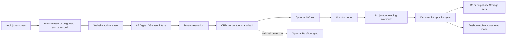

# AudioJones Clean Handoff Contract

**Status:** architecture contract specification
**Date:** 2026-07-03
**Owner:** AJ Digital OS engineering
**Scope:** receiving-side contract for `audiojones-clean` website lead and diagnostic handoff into AJ-DIGITAL-OS-V1 CRM, operations, onboarding, deliverable, and reporting layers
**Decision level:** documentation only. No endpoint, migration, workflow, CRM sync, UI, n8n, HubSpot, storage, or production implementation is authorized by this document.

## Decision Summary

`audiojones-clean` is the public website, diagnostic, lead capture, and conversion-event source.

AJ-DIGITAL-OS-V1 is the canonical CRM and operational truth for accepted website handoffs.

Canonical split:

| System | Canonical ownership |
| --- | --- |
| `audiojones-clean` | Website content, public forms, diagnostics, lead submission records, diagnostic score/report snapshots, conversion events, handoff requests |
| AJ-DIGITAL-OS-V1 | Tenant resolution, CRM contacts, companies, leads, opportunities, clients, projects/workflows, onboarding, tasks, milestones, deliverables, approvals, reporting projections, audit, attribution, memory |
| FIVR / methodology layer | Diagnostic semantics, scoring contracts, offer-routing rules, interpretation logic |
| n8n | Orchestration only. It may deliver events or trigger workflows, but it owns no lifecycle truth |
| R2 / Supabase Storage | File and artifact storage only. OS records own file references and lifecycle metadata |
| HubSpot | Optional future external CRM projection target only. HubSpot is not canonical CRM truth |
| PostHog | Website and product behavior analytics only |
| Metabase | Read-only reporting over approved projections or reporting views |

Hard rule:

AJ Digital OS must not depend on shared database access to `audiojones-clean`. The integration is event-based, idempotent, signed, and tenant-scoped.

Public-repo caution:

`AJ-DIGITAL-OS-V1` is public at `https://github.com/AudioJones-Dev/AJ-DIGITAL-OS-V1.git`. Do not commit secrets, client data, private CRM exports, production database dumps, sensitive operational logs, non-public deliverables, or credential values.

## Source Alignment

This document aligns with:

- `C:\dev\audiojones-clean\docs\architecture\CLIENT_LIFECYCLE_SCHEMA.md`
- `docs/integration/PORTAL_OS_INTEGRATION_CONTRACT.md`
- `docs/specs/AJ_DIGITAL_MULTI_TENANT_CRM_MODULE_SPEC.md`
- `docs/specs/AJ_DIGITAL_MULTI_TENANT_CRM_DB_RLS_SPEC.md`
- `docs/system/AJ_DIGITAL_OS_MASTER_ARCHITECTURE_SCHEMA.md`
- `docs/architecture/deliverable-and-approval-routing-spec.md`
- `docs/architecture/deliverable-approval-lifecycle-spec.md`
- `src/crm/crm-types.ts`
- `src/crm/crm-service.ts`
- `src/crm/crm-schemas.ts`
- `src/types/deliverable.types.ts`
- `src/core/deliverable-store.ts`
- `src/services/runtime/deliverable-lifecycle.ts`
- `sql/supabase-schema.sql`
- `supabase/migrations/20260626150000_crm_multitenant_rls.sql`

Observed facts:

- Existing portal integration doctrine uses contract-based events and projections, never shared database access.
- The CRM module is tenant-native and uses `tenantId` as the CRM isolation boundary.
- CRM service actions create tenant-scoped CRM records and emit audit/attribution events.
- The CRM DB/RLS spec requires tenant-scoped tables, explicit tenant context, and deny-by-default RLS.
- Existing SQL surfaces define `clients`, `missions`, `mission_runs`, `deliverables`, and `assets`.
- Existing deliverable lifecycle supports `draft`, `pending_approval`, `approved`, and `published` states.
- `audiojones-clean` currently owns website lead and diagnostic submissions, not operational CRM/project/deliverable truth.

Inference:

The website-to-OS integration should reuse the same event/projection doctrine as the portal contract, with OS receiving signed handoff requests and producing downstream operational references.

Assumption:

The first implementation will be contract-first and docs-only until tenant resolution, intake transport, and target database posture are approved.

## Lifecycle Contract



Canonical lifecycle:

1. Website visitor submits a form or diagnostic in `audiojones-clean`.
2. `audiojones-clean` stores the source lead, diagnostic session, score snapshot, attribution, consent, and route data.
3. `audiojones-clean` emits a signed, retryable handoff event after durable source persistence.
4. AJ Digital OS receives the event through an approved intake surface.
5. AJ Digital OS validates signature, schema version, idempotency, source system, consent, and tenant resolution.
6. AJ Digital OS creates or links CRM contact, company, lead, and opportunity records inside a tenant boundary.
7. AJ Digital OS emits audit and attribution events for accepted operational writes.
8. A qualified or won opportunity can create or link a client account and onboarding workflow.
9. Workflows produce deliverables, approvals, reports, and storage references inside AJ Digital OS.
10. Reporting reads from OS-owned records or approved projections.
11. HubSpot, if approved later, receives a projection from OS or an approved outbox, not canonical ownership.

## Event Ownership Principles

- `audiojones-clean` owns source events.
- AJ Digital OS owns operational records created from source events.
- Events are append-only facts. They are not editable CRM records.
- AJ Digital OS must not scrape website tables.
- `audiojones-clean` must not write directly into AJ Digital OS tables.
- n8n may transport or fan out events, but durable state remains in Postgres-backed systems.
- PostHog and Metabase receive analytics/reporting projections only.
- HubSpot receives optional future sync projections only after OS ownership is preserved.
- Every accepted handoff must carry stable source IDs for traceability.
- Every operational write must resolve `tenantId` before mutation.

## Event Envelope

All website-to-OS events should use a versioned envelope:

```json
{
  "eventId": "uuid",
  "eventType": "website.handoff_requested",
  "schemaVersion": 1,
  "occurredAt": "2026-07-03T00:00:00.000Z",
  "sourceSystem": "audiojones-clean",
  "environment": "production",
  "correlationId": "uuid-or-stable-trace-id",
  "causationId": "optional-upstream-event-id",
  "source": {
    "leadId": "website-lead-id",
    "diagnosticSessionId": "optional-session-id",
    "diagnosticResultId": "optional-result-id",
    "sourceRoute": "/diagnostics/founder-intelligence"
  },
  "actor": {
    "type": "website_visitor",
    "id": "anonymous-or-known-visitor-reference"
  },
  "data": {}
}
```

Rules:

- `eventId` is the idempotency key.
- `sourceSystem` must equal `audiojones-clean`.
- `schemaVersion` must be explicit and additive within v1.
- `occurredAt` must be ISO-8601 UTC.
- `data` contains event-specific payload only.
- PII must stay in the body of signed server-to-server events, never in URLs.
- Payloads must not contain secrets, raw tokens, private CRM exports, or storage credentials.

## Accepted Website Event Families

| Event | Producer | OS action |
| --- | --- | --- |
| `website.lead_captured` | `audiojones-clean` | Optional pre-handoff event for attribution and intake queueing |
| `website.diagnostic_started` | `audiojones-clean` | Optional analytics/reporting event; no CRM write by default |
| `website.diagnostic_completed` | `audiojones-clean` | Attach diagnostic result snapshot to lead or opportunity when tenant and lead are resolved |
| `website.booking_clicked` | `audiojones-clean` | Record booking intent and optionally create follow-up task if lead exists |
| `website.handoff_requested` | `audiojones-clean` | Main operational intake event for CRM and opportunity creation/linking |
| `website.suppression_updated` | `audiojones-clean` | Update consent/suppression projection if the source person is resolved |

## Required Handoff Payload

`website.handoff_requested` must include enough data for OS intake to resolve, create, or link CRM records without reaching back into the website database.

```json
{
  "lead": {
    "sourceLeadId": "uuid-or-text",
    "email": "founder@example.com",
    "firstName": "Founder",
    "lastName": "Name",
    "fullName": "Founder Name",
    "phone": "+15555555555",
    "companyName": "Example Co",
    "companyDomain": "example.com",
    "consentToContact": true,
    "suppressionStatus": "not_suppressed"
  },
  "diagnostic": {
    "diagnosticKey": "founder-intelligence",
    "diagnosticVersion": "1.0.0",
    "sessionId": "diagnostic-session-id",
    "resultId": "diagnostic-result-id",
    "completedAt": "2026-07-03T00:00:00.000Z",
    "scoreSummary": {
      "totalScore": 82,
      "priority": "urgent",
      "rawRiskScores": {},
      "normalizedHealthScores": {}
    }
  },
  "routing": {
    "recommendedOffer": "Founder Intelligence Systems Engagement",
    "handoffReason": "qualified_lead",
    "urgency": "high",
    "requestedNextAction": "create_or_link_lead"
  },
  "attribution": {
    "sourcePage": "/founder-intelligence",
    "referrer": null,
    "utmSource": null,
    "utmMedium": null,
    "utmCampaign": null,
    "utmTerm": null,
    "utmContent": null
  }
}
```

PII rule:

The examples above use placeholder data only. Real payloads are runtime data and must not be committed.

## Tenant Resolution

AJ Digital OS must resolve a `tenantId` before creating or updating CRM records.

Resolution inputs:

- explicit `tenantId` in approved internal handoff events, if available
- source route or diagnostic key
- company domain
- email domain
- existing CRM contact/company lookup inside approved tenant context
- operator-reviewed mapping table
- default AJ internal intake tenant for unassigned public website leads

Required result:

```ts
type TenantResolutionResult =
  | { status: "resolved"; tenantId: string; reason: string }
  | { status: "needs_review"; reason: string }
  | { status: "rejected"; reason: string };
```

Rules:

- No CRM write may run without `tenantId`.
- If tenant resolution is ambiguous, write an intake/dead-letter record and require operator review.
- Cross-tenant lookup must be explicit, read-only, audited, and restricted to approved platform-owner intake logic.
- Demo, sandbox, and seed tenants must be blocklistable.
- A tenant resolution decision must be traceable to the source event ID.

## Intake Processing Contract

Future intake should follow this sequence:

1. Receive raw request body.
2. Verify HMAC signature and timestamp.
3. Parse envelope and validate `schemaVersion`.
4. Check `eventId` idempotency.
5. Persist raw event metadata and safe payload snapshot.
6. Resolve source system and environment.
7. Resolve tenant.
8. Validate consent and suppression.
9. Create or link contact/company.
10. Create or link lead.
11. Optionally create or link opportunity.
12. Attach diagnostic result metadata to CRM/opportunity context.
13. Emit tenant-scoped audit and attribution events.
14. Return accepted/rejected receipt.
15. Optionally enqueue workflow/onboarding/reporting actions.

Out of scope for this document:

- endpoint implementation
- migration creation
- webhook secret creation
- n8n workflow implementation
- HubSpot sync implementation
- dashboard UI work

## CRM Object Mapping

| Website payload | AJ Digital OS target | Notes |
| --- | --- | --- |
| `lead.email` | `CrmContact.email` | Use tenant-scoped dedupe. No global contact lookup |
| `lead.firstName`, `lead.lastName`, `lead.fullName` | `CrmContact.firstName`, `CrmContact.lastName` | Full name may be parsed only as a fallback |
| `lead.phone` | `CrmContact.phone` | Normalize when implementation exists |
| `lead.companyName` | `CrmCompany.name` | Create or link inside tenant |
| `lead.companyDomain` | `CrmCompany.domain` | Tenant-scoped dedupe candidate |
| `lead.consentToContact` | `CrmContact.consentStatus` | `true` maps to `opted_in`; false/unknown requires suppressed or review behavior |
| `routing.urgency` | `CrmLead.urgency` | `low`, `medium`, or `high` |
| `diagnostic.scoreSummary.totalScore` | `CrmLead.score` | 0-100 score only if polarity is normalized for CRM triage |
| `routing.recommendedOffer` | lead/opportunity metadata | Offer routing remains methodology-derived |
| `source.leadId` | source reference metadata | Preserve for idempotency and traceability |
| `source.diagnosticSessionId` | diagnostic source reference | Do not duplicate website answer rows unless a future import is approved |
| `attribution.*` | `crm_attribution_events` metadata | Tenant-scoped attribution only |

Required CRM context:

```ts
interface WebsiteHandoffCrmContext {
  tenantId: string;
  actorType: "system";
  actorId: "audiojones-clean";
  riskLevel: "L1" | "L2";
  approvalStatus: "not_required" | "pending" | "approved";
}
```

Implementation note:

Existing `CrmService` supports contact, lead, and opportunity creation through permission and approval gates. Future intake should use service contracts rather than bypassing CRM governance.

## Opportunity And Deal Mapping

AJ Digital OS should create or link an opportunity only when handoff qualification rules are met.

Potential qualification inputs:

- diagnostic priority
- routing recommendation
- booking intent
- explicit form selection
- score threshold from FIVR/methodology
- operator review

Recommended opportunity creation policy:

| Condition | Action |
| --- | --- |
| Consent missing or suppressed | Reject CRM action or route to review |
| Tenant unresolved | Dead-letter for review |
| Lead captured but low-fit | Create/link lead only |
| Qualified diagnostic or booking intent | Create/link lead and opportunity |
| Closed-won or operator approved | Link/create client account and onboarding workflow |

Opportunity fields:

- `tenantId`
- `opportunityId`
- `pipelineId`
- `stageId`
- `contactId`
- `companyId`
- `status`
- optional `value`
- optional `currency`
- optional `expectedCloseAt`
- metadata with website source refs and routing recommendation

## Client, Project, And Onboarding Mapping

AJ Digital OS owns the transition from commercial opportunity to operational client work.

Recommended stages:

1. `website.handoff_requested` creates or links CRM lead.
2. Qualified lead creates or links CRM opportunity.
3. Operator or approved automation marks opportunity as accepted/won.
4. OS creates or links client account or tenant workspace.
5. OS starts onboarding workflow or mission.
6. Workflow creates tasks, milestones, approval requests, deliverable intents, and report outputs.

Current schema alignment:

- Existing SQL defines `clients`, `missions`, and `mission_runs`.
- Existing CRM specs define `crm_tenants`, `crm_contacts`, `crm_companies`, `crm_leads`, and `crm_opportunities`.
- Existing portal contract allows event/projection mapping for client-facing `projects` and `milestones`.

Open design point:

The exact object that represents "project" inside OS still needs a final canonical mapping. Until that is approved, website handoff should stop at CRM lead/opportunity and workflow intent, not invent a new project table.

## Deliverable And Report Mapping

AJ Digital OS owns deliverable and report lifecycle after operational work begins.

Existing lifecycle states:

- `draft`
- `pending_approval`
- `approved`
- `published`

Existing valid transitions:

- `draft -> pending_approval`
- `pending_approval -> approved`
- `approved -> published`

Mapping doctrine:

| Concept | Owner | Notes |
| --- | --- | --- |
| public diagnostic report snapshot | `audiojones-clean` | Conversion and follow-up snapshot |
| client deliverable record | AJ Digital OS | Operational artifact metadata and lifecycle state |
| report-ready event | AJ Digital OS | Can project to website/portal/read model |
| binary file | R2 or Supabase Storage | Storage owns object bytes only |
| storage reference | AJ Digital OS | OS record owns object keys/URLs and permissions |

Future `ajos.report_ready` receipt:

```json
{
  "eventId": "uuid",
  "eventType": "ajos.report_ready",
  "schemaVersion": 1,
  "occurredAt": "2026-07-03T00:00:00.000Z",
  "tenantId": "tenant-id",
  "sourceSystem": "AJ-DIGITAL-OS-V1",
  "data": {
    "sourceLeadId": "website-lead-id",
    "deliverableId": "deliverable-id",
    "reportRef": "report-reference",
    "status": "published",
    "artifactRefs": [
      {
        "storageProvider": "r2",
        "objectKey": "tenant/reports/example.pdf",
        "contentType": "application/pdf"
      }
    ]
  }
}
```

## Receipts Back To Website

AJ Digital OS should return receipts rather than allowing website writes into OS tables.

Receipt events:

| Event | Direction | Purpose |
| --- | --- | --- |
| `ajos.handoff_accepted` | OS -> website/read model | Handoff accepted and downstream refs created or linked |
| `ajos.handoff_rejected` | OS -> website/read model | Handoff rejected with safe reason code |
| `ajos.handoff_needs_review` | OS -> website/read model | Handoff parked for operator review |
| `ajos.report_ready` | OS -> website/portal/read model | Report or deliverable projection is ready |

Receipt payload should include:

- source `eventId`
- source website lead ID
- tenant ID
- created or linked object references
- safe status reason code
- timestamp
- correlation ID

Example accepted receipt:

```json
{
  "eventId": "uuid",
  "eventType": "ajos.handoff_accepted",
  "schemaVersion": 1,
  "occurredAt": "2026-07-03T00:00:00.000Z",
  "sourceSystem": "AJ-DIGITAL-OS-V1",
  "correlationId": "original-correlation-id",
  "data": {
    "sourceEventId": "website-event-id",
    "sourceLeadId": "website-lead-id",
    "tenantId": "tenant-id",
    "contactId": "contact-id",
    "companyId": "company-id",
    "leadId": "lead-id",
    "opportunityId": "opportunity-id",
    "status": "accepted"
  }
}
```

## Idempotency

Required keys:

- `eventId` for event-level idempotency
- `sourceSystem`
- `source.leadId`
- `source.diagnosticSessionId`, when present
- `tenantId`, after resolution

Rules:

- Duplicate `eventId` returns the original outcome.
- Duplicate source lead inside the same tenant links to the existing CRM lead/contact when safe.
- Duplicate source lead across possible tenants requires review.
- New diagnostic completion for an existing lead should append or update diagnostic metadata according to version rules.
- OS-created object refs must be stable in receipts.
- Retries must not create duplicate contacts, companies, leads, opportunities, tasks, or workflows.

## HMAC And Security Requirements

Future intake should reuse the established OS HMAC style where practical:

- signed raw body
- timestamp header
- nonce header
- webhook ID header
- replay window
- timing-safe signature comparison
- distinct secret per producer and environment

Reserved env names only:

- `AUDIOJONES_CLEAN_TO_OS_WEBHOOK_SECRET`
- `AUDIOJONES_CLEAN_WEBHOOK_MAX_SKEW_SECONDS`
- `AUDIOJONES_CLEAN_WEBHOOK_REPLAY_TTL_SECONDS`

Do not commit values for these names.

Security requirements:

- Intake must fail closed on missing or invalid signature.
- Intake must reject replayed nonces.
- Intake must reject malformed payloads before operational writes.
- Tenant context must be resolved before CRM mutation.
- Raw secrets must never be logged.
- PII must not be included in URLs, query strings, or log labels.
- Payload logging must be redacted or limited to safe snapshots.
- Cross-tenant lookups must be audited and restricted.

## Consent And Suppression

Consent rules:

- `consentToContact = true` can map to `CrmContact.consentStatus = "opted_in"`.
- `consentToContact = false` must not trigger outbound follow-up automation.
- Suppressed contacts must not create outbound tasks except review/remediation tasks.
- Consent source, timestamp, and source route should be preserved in metadata.
- Suppression updates from the website should be accepted only with stable source references.

Required suppression outcomes:

| Input | OS behavior |
| --- | --- |
| consent true, not suppressed | allow CRM intake |
| consent false | create review-safe record or reject outbound action |
| suppression unknown | create lead only if policy allows; no outbound automation |
| explicit opt-out | mark contact opted out and block outbound workflow |

## Audit And Attribution

Every accepted operational write should emit tenant-scoped audit and attribution.

Recommended audit events:

- `website_handoff_received`
- `website_handoff_accepted`
- `website_handoff_rejected`
- `crm_contact_created`
- `crm_contact_updated`
- `crm_lead_created`
- `crm_opportunity_created`
- `onboarding_workflow_requested`
- `deliverable_report_ready`

Recommended attribution events:

- `website_lead_captured`
- `diagnostic_completed`
- `lead_source_classified`
- `lead_scored`
- `lead_qualified`
- `opportunity_created`
- `opportunity_won`
- `workflow_completed`
- `report_ready`

Required dimensions:

- `tenantId`
- source system
- source lead ID
- diagnostic key
- event ID
- actor type
- actor ID
- source route
- UTM fields when present
- related contact/lead/opportunity/workflow/deliverable IDs when present

## n8n Boundary

n8n may:

- receive an event and call the OS intake endpoint
- fan out non-canonical notifications
- schedule follow-up orchestration
- call approved OS APIs with signed credentials

n8n must not:

- store canonical CRM/contact/project/deliverable truth
- make tenant resolution decisions without OS policy
- own idempotency state
- become the retry source of record unless backed by OS/website outbox state
- hold long-lived client data beyond workflow execution needs

## HubSpot Boundary

HubSpot is optional future sync only.

Rules:

- HubSpot is not canonical CRM truth.
- HubSpot object IDs may be stored as external references after approval.
- HubSpot sync should occur only after OS object creation/linking is stable.
- HubSpot writes must not bypass AJ Digital OS tenant context.
- HubSpot sync failures must not corrupt OS CRM records.
- HubSpot dedupe rules must be documented before wiring.

## Reporting Boundary

Reporting ownership:

| Reporting need | Source |
| --- | --- |
| website funnel | `audiojones-clean` events and PostHog |
| diagnostic performance | `audiojones-clean` diagnostic snapshots plus approved projections |
| CRM relationship status | AJ Digital OS CRM |
| opportunity pipeline | AJ Digital OS CRM |
| onboarding status | AJ Digital OS workflow/client records |
| deliverable inventory | AJ Digital OS deliverable records plus storage refs |
| executive rollup | approved Metabase/read model projection |

Metabase should query approved read models or reporting views. It must not write lifecycle state.

## Future Intake Surface

Candidate endpoint:

```txt
POST /api/events/audiojones-clean/intake
```

This is a candidate only. Endpoint creation is not authorized by this document.

Minimum implementation requirements before endpoint work:

- endpoint path approved
- HMAC header names approved
- tenant resolution policy approved
- idempotency storage approved
- event log/dead-letter storage approved
- consent behavior approved
- CRM service mapping approved
- no direct website database access
- no Firebase

## Validation Rules

Before implementation, a receiving-side contract test plan should validate:

- rejects unsigned payload
- rejects bad signature
- rejects stale timestamp
- rejects replayed nonce
- rejects missing `eventId`
- rejects unknown `sourceSystem`
- accepts duplicate `eventId` without duplicate CRM writes
- dead-letters unresolved tenant
- blocks outbound workflow when consent is false
- creates/links contact inside tenant only
- creates/links lead inside tenant only
- creates opportunity only when qualification rules pass
- emits audit event for accepted and rejected handoffs
- emits attribution event for accepted qualified handoff
- returns stable downstream refs in receipt

## Implementation Phases

### Phase 1 - Contract Approval

- Approve this document.
- Confirm `audiojones-clean` source ownership.
- Confirm AJ Digital OS operational ownership.
- Confirm HubSpot optional-sync-only boundary.
- Confirm no shared database access.

### Phase 2 - Event Schema Package

- Define TypeScript event envelope and payload types.
- Define Zod validators.
- Define receipt types.
- Add tests for schema validation only.
- No runtime endpoint yet.

### Phase 3 - Intake Storage Design

- Define event log, idempotency, nonce, and dead-letter persistence.
- Choose Postgres/Supabase/Neon placement.
- Define redaction policy.
- No live integration yet.

### Phase 4 - Tenant Resolution Contract

- Define default intake tenant.
- Define source-route and domain mapping.
- Define review queue behavior.
- Define seed/demo tenant blocklist.

### Phase 5 - CRM Adapter Implementation

- Map accepted handoff into `CrmService`.
- Create/link contact, company, lead, and optional opportunity.
- Emit audit and attribution.
- Keep endpoint disabled or local-only until approval.

### Phase 6 - Website Outbox Integration

- Implement website outbox and retry semantics in `audiojones-clean`.
- Wire signed delivery to OS intake only after both sides pass contract tests.

### Phase 7 - Reporting And Optional Sync

- Add read model projection.
- Add optional HubSpot sync plan only after OS remains canonical.
- Add Metabase dashboard only from approved read models.

## Risk Register

| Risk | Severity | Mitigation |
| --- | --- | --- |
| Duplicate CRM truth between website, OS, HubSpot, and n8n | High | OS owns CRM; website owns source capture; HubSpot optional projection; n8n orchestration only |
| Tenant resolution ambiguity | High | Dead-letter ambiguous events and require operator review |
| Duplicate records from retries | High | Event idempotency plus tenant-scoped source refs |
| Direct DB coupling between website and OS | High | Signed event intake only |
| Consent/suppression mismatch | High | Preserve source consent and block outbound workflow on false or suppressed status |
| HubSpot becomes de facto truth | Medium | Store HubSpot IDs as external refs only after OS object creation |
| n8n stores long-lived client state | Medium | Use outbox and OS event log as durable truth |
| PII leaks in public repo or logs | High | Placeholder docs only, redacted logging, no committed runtime payloads |
| Project object mapping remains unresolved | Medium | Stop first implementation at CRM/opportunity and workflow intent until project model is approved |
| Public repo receives sensitive operational artifacts | High | Keep real payloads, secrets, exports, dumps, and deliverables out of git |

## Open Questions

1. Should first OS intake be direct signed HTTP, n8n-mediated delivery, or both with different roles?
2. What is the default intake `tenantId` for public Audio Jones website leads?
3. What fields are required to safely resolve company/contact duplicates inside a tenant?
4. What score threshold or route condition creates an opportunity instead of lead-only?
5. Which object represents the canonical project in the first OS implementation: `mission`, portal `project` projection, a future `project`, or another workflow wrapper?
6. Where should idempotency and dead-letter records live: Supabase CRM DB, Neon OS DB, or a dedicated intake store?
7. Which receipt path should website consume first: synchronous response, webhook callback, reporting projection, or manual review dashboard?
8. What is the approved redaction policy for event logs containing PII?

## Definition Of Done

This contract is done when:

- AJ Digital OS is documented as the receiving-side operational owner.
- `audiojones-clean` is documented as source system only.
- CRM, opportunity, client, onboarding, deliverable, reporting, n8n, HubSpot, and storage boundaries are explicit.
- The inbound event envelope and `website.handoff_requested` payload are specified.
- Tenant resolution and idempotency requirements are specified.
- No code, migrations, routes, UI, secrets, workflows, or production integrations are changed.

## Next Implementation Prompt

```txt
Review/Diagnosis owner: Codex
Actionable AI Assistant Task owner: Codex
Execution location/tool: C:\dev\AJ-DIGITAL-OS
Human/operator role: Audio approves event schema package only; no endpoint or migration yet
Copy/paste destination: Codex

Task:
Create the Phase 2 event schema package plan for receiving `audiojones-clean` website handoff events into AJ Digital OS.

Source documents:
- docs/architecture/AUDIOJONES_CLEAN_HANDOFF_CONTRACT.md
- docs/integration/PORTAL_OS_INTEGRATION_CONTRACT.md
- docs/specs/AJ_DIGITAL_MULTI_TENANT_CRM_MODULE_SPEC.md
- docs/specs/AJ_DIGITAL_MULTI_TENANT_CRM_DB_RLS_SPEC.md
- src/crm/crm-types.ts
- src/crm/crm-service.ts
- src/crm/crm-schemas.ts

Create one Markdown file only:
docs/architecture/AUDIOJONES_CLEAN_HANDOFF_EVENT_SCHEMA_PLAN.md

Required sections:
1. Current contract summary
2. Event envelope type plan
3. Website handoff payload type plan
4. Receipt type plan
5. Tenant resolution result type plan
6. Zod validation plan
7. Idempotency key plan
8. Consent and suppression validation plan
9. CRM mapping validation plan
10. Test fixture strategy using placeholder data only
11. Files proposed for a future code phase
12. Out of scope
13. Validation commands
14. Risk register
15. Definition of done

Constraints:
- Documentation only.
- Do not create endpoint code.
- Do not create migrations.
- Do not modify CRM runtime behavior.
- Do not wire n8n.
- Do not wire HubSpot.
- Do not write secrets.
- Do not commit runtime payloads or client data.
- AJ Digital OS remains CRM and operational truth.
- `audiojones-clean` remains source system only.
```
