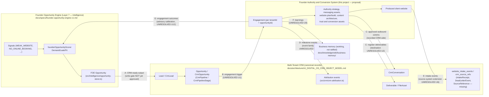

# System Boundary and Integration Map

Phase 1 deliverable 5 required by `docs/specs/prospect-brand-website-system/OPERATOR_RULINGS_2026-07-19.md` ("Phase 1 Required Deliverables", item 5). This document maps the boundary between three systems and defines integration contracts between them. It designs **handoffs, required fields, workflow triggers, and asset-generation interfaces only** — it does not design a prospect database, a scoring engine, a qualification methodology, a CRM object model, an opportunity pipeline, or a client identity system, all of which are prohibited by Ruling 4.

Naming note: "Founder Authority and Conversion System" (abbreviated FACS below) is the provisional name approved in Ruling 3. AJ Digital's core category remains **Founder Intelligence Systems and operational intelligence consultancy for founder-led service businesses**; FACS is an adjacent, productized service inside that category, not a repositioning of it.

Reading convention used throughout:

- **VERIFIED CURRENT STATE** — facts confirmed against files in the worktree `C:\dev\AJ-DIGITAL-OS-prospect-brand-website-system` (exact paths cited).
- **PROPOSED FUTURE STATE** — integration design proposed by this document; nothing here is canonical or implemented, and nothing here authorizes code.

---

## 1. Three-System Ownership (Ruling 4)

The ownership boundary below is quoted from Ruling 4 of `OPERATOR_RULINGS_2026-07-19.md` and is binding on all Phase 1 documents:

> - **Founder Opportunity Engine** → discovers and qualifies prospects (prospect discovery, website/revenue-leak analysis, qualification, scoring, CRM-ready opportunity output)
> - **Multi-Tenant CRM** → stores prospect, opportunity, communication, and lifecycle records (canonical prospect and company records, opportunity lifecycle, communications, tasks, pipeline state, attribution and customer history where already specified)
> - **Founder Authority and Conversion System** → delivers the approved website, authority, content, trust, and conversion assets (founder and company source collection, authority strategy, messaging and positioning assets, website planning and production, content architecture, trust assets, conversion assets, approved handoffs into CRM and intelligence systems)

### 1.1 Founder Opportunity Engine (FOE) — VERIFIED CURRENT STATE

Spec: `docs/specs/founder-opportunity-engine-v1.md`.

- Home: AJ-DIGITAL-OS internal intelligence subsystem (Layer 7, Intelligence, of the sixteen-layer model in `docs/architecture/AJ_DIGITAL_OS_LAYER_MODEL_SPEC.md`). Targets established, call-heavy service businesses; primary offer fit is AI Receptionist / ResponseOS, with website work only a secondary fit.
- Vocabulary contract (spec L19): **"Signal"** is the atomic input vocabulary; **"Opportunity"** is the scored output vocabulary.
- Owns: signal derivation (`WEAK_WEBSITE`, `NO_ONLINE_BOOKING`, `NO_CHAT`, `FOLLOWUP_GAP`, `NO_CLICK_TO_CALL`, `ALREADY_SOLVED`, `OWNER_OPERATED`, `HIGH_CALL_DEMAND`, `CALL_FIRST_CATEGORY`, `AFTER_HOURS_GAP`, `RESPONSIVENESS_COMPLAINTS`, `LOCAL_REGIONAL`, `REACHABLE_CONTACT_INFO`), disqualifier gates, the Demand(40)/Leak(40)/Fit(20) scoring axes, the `fitFactor` formula, and the PARK / WATCH / QUALIFIED thresholds (spec L107–173).
- Persists FOE opportunities through the existing `src/intelligence/opportunity-store.ts` path (spec L54–56; file verified present in the worktree), scored by a distinct `founderOpportunityScorer` — explicitly not the AEO keyword scorer in `src/intelligence/opportunity-scorer.ts` (also verified present).
- Compliance boundary: only `placeId` and AJ-derived facts persist; raw Google Places fields (review count, rating, phone, category, hours, review text) never persist (spec L59–83).
- Explicit scope limit: **no external CRM writes and no paid API execution without a separate approval gate** (spec L49).

### 1.2 Multi-Tenant CRM — VERIFIED CURRENT STATE

Sources: `docs/architecture/AJ_DIGITAL_OS_CRM_OBJECT_MODEL.md` (object model), `docs/specs/AJ_DIGITAL_MULTI_TENANT_CRM_MODULE_SPEC.md` (module spec), `docs/specs/AJ_DIGITAL_MULTI_TENANT_CRM_DB_RLS_SPEC.md` (DB/RLS spec).

- Owns the canonical object model: `Tenant`, `Contact`, `Company`, `Lead`, `Opportunity`, `Client`, `ClientAccount` (logical bridge, not built), `Project` (boundary open/blocked), `ProjectMember` (future), `WorkflowRun`, `Task`, `Deliverable`, `FileAsset`, `ApprovalRequest`, `Report`, `ActivityLog`, `IntakeReceipt` (required, missing), `DeadLetterEvent` (required, missing), `SourceReference` (required, missing/partial) — object model L104–124.
- Owns lifecycles: Contact (`new, lead, qualified, customer, inactive`), Lead (`new, working, qualified, unqualified, converted, lost`), Opportunity (`open, won, lost` with tenant-scoped `CrmPipeline`/`CrmPipelineStage`), Company (`prospect, active_client, inactive, archived`), and the commercial lifecycle chain contact identified → lead created → lead qualified → opportunity opened → won|lost → client account created after approval (object model L204–276, L628–635). These lifecycles must not collapse into one write path (object model L651).
- Owns communications: `CrmConversation` (`channel: "phone"|"sms"|"email"|"chat"|"form"|"manual"`; links to `contactId`/`leadId`/`opportunityId`) — module spec L433–449. Outbound agent communications are approval-gated by default (module spec L657–667).
- Owns attribution: tenant-scoped attribution events (module spec §14, L682–737), runtime surface `src/crm/crm-attribution.ts` (verified present). Attribution is Layer 14 of the OS layer model.
- Canonical doctrine (object model L14–22): `audiojones-clean` may request intake; AJ Digital OS decides canonical CRM state; no website event directly creates a project; HubSpot is optional external projection only; n8n is orchestration only.
- Verified runtime surface: `src/crm/` (`crm-types.ts`, `crm-service.ts`, `crm-store.ts`, `persistent-crm-store.ts`, `postgres-crm-store.ts`, `crm-schemas.ts`, `crm-approval-policy.ts`, `crm-attribution.ts`, `crm-audit.ts`, `tenant-context.ts`, `tenant-scoped-store.ts`, and others), migration `supabase/migrations/20260626150000_crm_multitenant_rls.sql`.

### 1.3 Founder Authority and Conversion System (FACS) — PROPOSED FUTURE STATE

FACS is documentation-only in Phase 1. Per Ruling 4 it owns, for prospects/clients that already exist as CRM records:

- Founder and company **source collection** for engaged prospects (evidence-classed research per `PROJECT_CHARTER.md` §8.1 — note the charter is partially overridden; see §8 below).
- **Authority strategy** and **messaging and positioning assets**.
- **Website planning and production** (briefs, sitemaps, copy decks, mocks, approved builds).
- **Content architecture**, **trust assets**, and **conversion assets**.
- **Approved handoffs** into the CRM and intelligence systems — never direct canonical writes.

FACS does **not** own: prospect discovery, leak analysis, qualification, or scoring (FOE); prospect/company/opportunity/communication/lifecycle records (CRM); tenancy or identity (CRM); attribution storage (CRM Attribution Layer). FACS's public positioning must follow the working copy direction in `docs/knowledge/wiki/business-memory/audio-jones-brand-philosophy-context.md` L39 ("I help founders turn expertise into systems so their business can think, remember, and execute consistently") and must not use internal-only language ("organizational cognition company", "Cognitive Operating System") per `docs/knowledge/wiki/business-memory/cos-internal-only.md` L22 — all business-memory content is `status: working`, confidence 2, not ratified for public use.

---

## 2. Duplicate-System Prohibitions (verbatim, Ruling 4)

Quoted verbatim from `OPERATOR_RULINGS_2026-07-19.md`, Ruling 4:

> The new system may define handoffs, required fields, workflow triggers, and asset-generation processes. It may not create another independent:
>
> - Prospect database
> - Lead-scoring engine
> - Qualification methodology
> - CRM object model
> - Opportunity pipeline
> - Canonical client identity system
>
> Document integration contracts and handoffs instead.

Concrete consequences for FACS documents and any later implementation:

| Prohibited | What FACS does instead |
|---|---|
| Prospect database | Reference CRM composite identifiers (`tenantId + contactId/leadId/opportunityId`); FACS asset metadata carries references, never parallel prospect records |
| Lead-scoring engine | Consume FOE opportunity scores and `CrmLead.score` (normalized 0–100); never compute a competing score |
| Qualification methodology | Consume FOE disqualifiers/thresholds and CRM qualification state (`Lead.status = qualified`); FACS may define *engagement-readiness checklists* for its own deliverables only, not prospect qualification |
| CRM object model | Use existing objects (`Deliverable`, `FileAsset`, `Task`, `ApprovalRequest`, `WorkflowRun`, `CrmConversation`); propose extensions through CRM spec amendment, never a parallel model |
| Opportunity pipeline | Use tenant-scoped `CrmPipeline`/`CrmPipelineStage`; any FACS-specific pipeline/stage is CRM configuration, not a new pipeline system |
| Canonical client identity system | `tenantId` and CRM identity remain canonical; FACS never mints contact/company/client identity |

This also retires, as integration-boundary violations, the charter's §12.1 `prospect` record and §9.2 seventeen-state `prospect_status` machine as *standalone* systems (see Open Contradictions, §8).

---

## 3. Source and Destination Objects

Only exact object/entity names from the existing specs are used. FACS-side artifacts are marked PROPOSED and are asset documents, not canonical records.

### 3.1 FOE → CRM seam — VERIFIED CURRENT STATE

- FOE emits "CRM-ready opportunities with research-ready rationale" serialized through its `opportunity-output/` module and persisted via `src/intelligence/opportunity-store.ts` (`docs/specs/founder-opportunity-engine-v1.md` L14, L28–41, L54–56).
- **The FOE "Opportunity" is not the CRM `Opportunity` object.** FOE opportunities live in the Intelligence Layer (Layer 7); canonical `CrmOpportunity` creation is gated by CRM service contracts, qualification rules, and approved pipeline/stage configuration. External CRM writes are explicitly outside FOE V1 scope without a separate approval gate (spec L49). Any FACS document that treats an FOE opportunity as a CRM record is wrong.

### 3.2 CRM canonical objects consumed by FACS — VERIFIED CURRENT STATE (objects exist as spec/types; some stores incomplete)

| Object (exact name) | Role for FACS | Source |
|---|---|---|
| `Tenant` / `crm_tenants` | Isolation scope for every FACS reference; tenant types `internal_aj \| client \| sandbox \| demo` | RLS spec L103, L124 |
| `Contact` / `CrmContact` | The founder as canonical person record (`lifecycleStage`, `consentStatus`, `source`, `companyId`) | module spec L341–357 |
| `Company` / `CrmCompany` | The founder-led business (service/store support incomplete) | object model L104–124 |
| `Lead` / `CrmLead` | Qualification state upstream of engagement (`status`, `score` — declared `score?: number` in the interface; normalized 0–100 at intake — `urgency`) | module spec L376–390 (interface); intake model L430 (0–100 normalization) |
| `Opportunity` / `CrmOpportunity` | Commercial vehicle a FACS engagement attaches to (`pipelineId`, `stageId`, `value`, `status`) | module spec L394–409 |
| `Client`, `ClientAccount` | Post-won identity (`ClientAccount` is a logical bridge, not built) | object model L104–124 |
| `Project` | Natural container for a FACS engagement — **boundary open/blocked**; no website event may create a project | object model L104–124, L14–22 |
| `Deliverable`, `FileAsset` | Candidate destinations for produced authority/website assets | object model L104–124 |
| `Task`, `WorkflowRun`, `ApprovalRequest`, `ActivityLog`, `Report` | Execution, approval, and audit surfaces | object model L104–124 |
| `CrmConversation` | Canonical communication record (FACS never stores communications itself) | module spec L433–449 |
| `IntakeReceipt`, `DeadLetterEvent`, `SourceReference` | Required intake bridge objects — **required but missing/partial** | object model L122–124 |

### 3.3 Website intake events — VERIFIED CURRENT STATE

`docs/architecture/AJ_DIGITAL_OS_INTAKE_EVENT_MODEL.md` (documentation only; no endpoint/migration authorized, L7):

- Approved source system: `audiojones-clean` **only** (L38).
- Event families: `website.lead_captured`, `website.diagnostic_started`, `website.diagnostic_completed`, `website.booking_clicked`, `website.handoff_requested`, `website.suppression_updated` (L44–51). Only `website.handoff_requested` may create/link operational CRM objects in the first implementation (L53).
- Handoff shape: `website.handoff_requested → contact/company/lead → optional opportunity → optional workflow intent or operator review` (L471–476). Recommended tables `website_intake_events` and `crm_source_refs` (L136–186).
- The Phase 1 schema package (`src/integrations/audiojones-clean/handoff-types.ts`, `handoff-schemas.ts`, tests — L750–753) does **not** exist in the worktree; FACS inherits that gap.

### 3.4 FACS artifacts — PROPOSED FUTURE STATE

FACS produces engagement-scoped asset documents (authority strategy, messaging/positioning assets, website briefs/sitemaps/copy decks, mocks, content architecture, trust assets, conversion assets). Proposed contract for every FACS artifact:

- Carries `tenantId` plus at least one CRM reference (`contactId`, `companyId`, `opportunityId`) — composite identity per object model L173, L196, L220, L243, L268.
- Registers in the CRM as a `Deliverable` and/or `FileAsset` reference once the destination question (§7, U2) is resolved — FACS holds working files; the CRM holds the canonical registry entry.
- Never introduces a FACS-local person/company identifier.

---

## 4. Required Identifiers — Who Mints, Who References

| Identifier | Minted by | Referenced by | Evidence |
|---|---|---|---|
| `tenantId` (`tenant_id`) | CRM (`crm_tenants`) | FOE outputs destined for CRM, intake events after tenant resolution, every FACS artifact | RLS spec L96–124; new CRM queries must not use legacy `client_id` as isolation key |
| `contactId`, `companyId`, `leadId`, `opportunityId` | CRM (composite with `tenantId`) | FACS artifacts, attribution events, `CrmConversation` links | object model L173, L196, L220, L243, L268 |
| `pipelineId`, `stageId` | CRM (tenant-scoped `CrmPipeline`/`CrmPipelineStage`) | Any FACS engagement-trigger rule (§5, Handoff B) | module spec L394–409 |
| `placeId` | Google (persisted by FOE as the only indefinitely-persisted Places datum) | FOE internals only — struck from the Handoff A field contract by operator Correction Ruling 2026-07-19 §3; must not travel in FOE→CRM handoff records and never appears in CRM records or FACS artifacts; any future transfer or persistence outside the governed FOE boundary requires a separately reviewed integration decision and specification amendment | FOE spec L59–83 |
| FOE opportunity record id | FOE (`src/intelligence/opportunity-store.ts` path/pattern) | CRM intake of FOE output (as source reference, not identity) | FOE spec L54–56 |
| `eventId` (+ `sourceSystem`) | Source system — `audiojones-clean` only today | `website_intake_events` idempotency (`source_system, event_id` unique) | intake model L86–108, L136–186 |
| `sourceSystem + sourceObjectType + sourceObjectId` | Source system; recorded by CRM in `crm_source_refs` | Dedup layer 2; `SourceReference` object (missing/partial) | intake model L136–186; object model L122–124 |
| `correlationId` / `causationId` | Source system per envelope | Cross-system tracing | intake model L86–108 |
| FACS engagement/asset ids — PROPOSED | FACS mints **document/asset ids only**, namespaced under an existing CRM identity (e.g. `tenantId + opportunityId + assetSlug`) | CRM `Deliverable`/`FileAsset` registry, attribution events | this document; requires ratification |
| `actorType`/`actorId`, `riskLevel` (L0–L4), `approvalStatus` | CRM action envelope (not identity, but required on every CRM-touching action) | Any future FACS automation | module spec L178–184 |

Rule: **FACS never mints identity for people, companies, tenants, leads, opportunities, or clients.** It mints only artifact identifiers, and those are meaningless without their CRM composite reference.

---

## 5. Workflow Handoffs

### Handoff A — FOE opportunity → CRM record

- VERIFIED CURRENT STATE: FOE scores an opportunity `>60 QUALIFIED → research brief + CRM output` (`docs/specs/founder-opportunity-engine-v1.md` L132–173) and persists via the `opportunity-store` path. External CRM writes are out of FOE V1 scope without a separate approval gate (L49). On the CRM side, opportunity creation from intake requires qualification (diagnostic priority, normalized score threshold, booking intent, route-specific offer fit, operator approval, pipeline policy — qualification-input list, `docs/architecture/AJ_DIGITAL_OS_INTAKE_EVENT_MODEL.md` L437–444) and an approved default pipeline/stage (not-allowed conditions and implementation prerequisites, L446–459).
- PROPOSED FUTURE STATE: when the FOE→CRM write gate is approved (unresolved, §7 U4), a QUALIFIED FOE opportunity becomes `Lead` (with `score` normalized 0–100 and `source` identifying FOE) and, only after CRM qualification rules pass, a `CrmOpportunity` on an approved pipeline. The FOE record id travels as a source reference (`SourceReference` pattern), never as the CRM identity.
- PROPOSED FUTURE STATE — **FOE handoff-record contract.** This is the "exact schema" that `SERVICE_OFFER_ARCHITECTURE.md` §10 (PROPOSED FUTURE STATE, item 2) defers to this map. It is a documentation-only field contract for the record FOE hands across the write gate; Ruling 4 permits defining handoffs and required fields, and no schema implementation, code, or transport is authorized by it. It requires FOE- and CRM-side ratification alongside the U4 gate decision:

| Field | Content | Constraint |
|---|---|---|
| FOE opportunity reference id | Record id from the `src/intelligence/opportunity-store.ts` persistence path (FOE spec L54–56) | Travels as a source reference (`SourceReference` pattern); never CRM identity (§4) |
| Fired signals + rationale | Fired-signal reasons and research rationale, AJ-derived facts only | FOE compliance boundary applies (spec L59–83); reference standard is the FOE compliance guard test cited in `SERVICE_OFFER_ARCHITECTURE.md` §10 |
| Score + axis subtotals | 0–100 total, Demand/Leak/Fit subtotals, threshold class (PARK/WATCH/QUALIFIED) | FOE-computed, consumed unchanged; mapping to `CrmLead.score` unresolved (§7, U5) |
| `derivedAt` | Derivation/scoring timestamp | — |
| Target tenant | `internal_aj` during prospecting (RLS spec L103) | Tenant resolution stays CRM-side (§7, U7) |
| Offer-fit indication | FOE fit signal for the receiving offer | FOE-owned vocabulary; neither the CRM nor FACS re-derives it |

  Versioning, serialization, transport, and gate placement for this record belong to the U4 write-gate decision (FOE/CRM territory); FACS consumes the record read-only. `placeId` was **struck from this contract** by operator Correction Ruling 2026-07-19 §3: this corpus establishes no direct or newly persistent FOE-to-FACS `placeId` channel, and any future requirement to transfer or persist `placeId` outside the currently governed FOE boundary requires a separately reviewed integration decision and applicable specification amendment.

### Handoff B — CRM opportunity → FACS engagement

- VERIFIED CURRENT STATE: nothing in the CRM specs defines a trigger for an authority/website engagement; `CrmPipelineStage` supports `requiresApproval` (inventory of module spec TS interfaces) and outbound/aggressive actions are approval-gated. `Project` creation is boundary open/blocked (object model L104–124).
- PROPOSED FUTURE STATE (contract shape only; trigger conditions unresolved, §7 U1): a FACS engagement starts from an existing `tenantId + opportunityId` (or `tenantId + clientId` post-won), records an `ApprovalRequest`-gated start decision, and receives a read-only snapshot of the CRM references it needs. FACS never advances `CrmOpportunity` stages itself; stage changes stay CRM-side actions.

### Handoff C — FACS outputs → CRM (deliverables, communications, tasks)

- PROPOSED FUTURE STATE: finished or client-facing FACS assets register as `Deliverable`/`FileAsset` references against the owning engagement's CRM identity (destination unresolved, §7 U2). Messaging assets that become actual outbound communications are executed and recorded CRM-side as `CrmConversation` entries under the default approval gate (module spec L657–667) — FACS supplies the asset; the CRM owns the communication record.

### Handoff D — FACS outputs → Attribution

- VERIFIED CURRENT STATE: attribution events are tenant-scoped with required families including `lead_created`, `lead_scored`, `lead_qualified`, `speed_to_lead_*`, `missed_call_*`, `opportunity_created/stage_changed/won/lost`, `revenue_leak_detected`, `agent_recommendation_created`; every event carries `tenantId`, `eventType`, actor fields, related ids, optional `mapScore` (module spec §14, L682–737; runtime `src/crm/crm-attribution.ts`).
- PROPOSED FUTURE STATE: FACS milestones (asset approved, website shipped, conversion asset live) emit attribution events **into** the existing Attribution Layer, referencing existing CRM ids. No authority-asset event family exists today (unresolved, §7 U3) — FACS proposes new `eventType` values through CRM spec amendment, not a parallel attribution store.

### Handoff E — FACS-produced websites → intake front door

- VERIFIED CURRENT STATE: the intake model's only approved source system is `audiojones-clean` (intake model L38), the sanctioned front door being signed envelope → `website_intake_events` → tenant resolution → `crm_source_refs` → CRM service → receipt/dead-letter. Hard blocks: no website event may create `Client`/`ClientAccount`/`Project`/`Deliverable`/`Report`.
- PROPOSED FUTURE STATE: client websites produced by FACS would need per-source-system registration (their own secrets, `sourceSystem` value, and tenant mapping) before they may emit intake events. That extension is not specified anywhere today (unresolved, §7 U6). Until then FACS websites have **no sanctioned event path** into the CRM.

### Handoff F — FACS outcomes → Business memory

- VERIFIED CURRENT STATE: `docs/knowledge/wiki/business-memory/` is entirely `status: working`, confidence 2, not ratified; the pilot README (L97–104) gates public positioning on Audio's approval, and agents "should not rewrite public positioning from these working notes without Audio approval" (`audio-jones-brand-philosophy-context.md` L85).
- PROPOSED FUTURE STATE: engagement learnings (what authority assets converted, category language that resonated) flow into business memory as working notes only, with no ratification authority. Mechanism unspecified (unresolved, §7 U9).

### Handoff G — FACS engagement outcomes → FOE calibration

- VERIFIED CURRENT STATE: `docs/specs/founder-opportunity-engine-v1.md` defines output only — no inbound feedback interface and no calibration-input contract exist; signal derivation, scoring axes, `fitFactor`, and thresholds are FOE-owned (spec L107–173), and the V1 fit model is ResponseOS-weighted with no authority-offer fit profile. `SERVICE_OFFER_ARCHITECTURE.md` §10 (PROPOSED FUTURE STATE, item 4) proposes that engagement outcomes (won/lost, observed leak closure) "may be offered back to FOE for calibration", with any change to FOE scoring or fit profiles owned by FOE and its own approval process.
- PROPOSED FUTURE STATE: FACS offers engagement outcomes to FOE as **advisory calibration input only** — an outcome record referencing the original FOE opportunity reference id and the CRM composite identity (`tenantId + opportunityId`), carrying outcome (`won`/`lost`), observed leak closure, and delivered-asset references. This sits inside Ruling 4's FACS ownership of "approved handoffs into CRM and intelligence systems" (FOE is the intelligence system). FACS never modifies FOE signals, scoring, thresholds, or fit profiles; whether and how FOE consumes the input is an FOE-side decision under FOE's own approval process. Mechanism, cadence, storage, and approval gate are unspecified (unresolved, §7 U12).

### End-to-end flow (proposed)

```text
FOE discovery/scoring (Layer 7)
  └─(A: gated CRM write, approval pending)→ CRM Lead → qualified → CrmOpportunity (pipeline/stage)
        └─(B: engagement trigger, unresolved)→ FACS engagement (authority/website/content production)
              ├─(C)→ CRM Deliverable / FileAsset / CrmConversation (assets registered, comms recorded)
              ├─(D)→ Attribution events (existing Layer 14 store)
              ├─(E: unresolved)→ produced website → intake events → CRM (front-door extension required)
              ├─(F: unresolved)→ business memory working notes (not ratified)
              └─(G: unresolved)→ engagement outcomes → FOE calibration input (advisory only; FOE-side decision)
```

---

## 6. Boundary Diagram



Arrow directions are handoffs, not shared ownership: everything left of an arrow stays owned by its source system.

---

## 7. Unresolved Integration Decisions

Where the FOE or CRM specs are silent on a needed integration point, it is listed here rather than designed unilaterally. Where approval rules are cited, note the pending governance amendments `PROPOSED_AMENDMENT-2026-07-10.md` and `PROPOSED_AMENDMENT-2026-07-18.md` (`G:\AJ-INTERNAL\AJ-DIGITAL-VAULT\00-CONTROL\GOVERNANCE`) remain unresolved context; approval-level answers below may shift when they are ratified or rejected.

- **U1 — Engagement trigger conditions.** Neither CRM spec defines when a `CrmOpportunity` becomes a FACS engagement: which pipeline/stage, whether `CrmPipelineStage.requiresApproval` is the gate or a dedicated `ApprovalRequest` is, whether pre-won opportunities qualify (speculative builds per `PROJECT_CHARTER.md` §10J) or only `won`, and who approves. Needs a CRM-side trigger contract plus operator ruling.
- **U2 — Where authority-asset metadata lives.** `Deliverable` and `FileAsset` exist as object names only; there is no asset-metadata schema for authority/messaging/website assets, and `Project` — the natural engagement container — is boundary open/blocked (object model L104–124). Options (CRM `Deliverable` extension vs. FACS-held files with CRM registry references) require a CRM spec amendment decision.
- **U3 — Attribution event families for FACS.** Module spec §14's required families cover leads, calls, opportunities, and leaks — nothing for authority assets, content, website launches, or conversion-asset performance. New `eventType` values (and whether `mapScore` applies to asset milestones) must be proposed as a CRM module-spec amendment.
- **U4 — FOE → CRM write gate.** FOE V1 forbids external CRM writes without a separate approval gate (FOE spec L49). The gate's owner, risk level (L0–L4 per module spec L178–184), and whether writes land as `Lead` only or may open a `CrmOpportunity` are undefined. FACS depends on this handoff existing but cannot define it.
- **U5 — FOE score → CRM score mapping.** FOE emits a 0–100 opportunity score (thresholds PARK/WATCH/QUALIFIED); `CrmLead.score` is normalized 0–100 per the intake model (L430). Whether the FOE score passes through unchanged, and whether FOE thresholds map to CRM qualification states, is unspecified. FACS must not define this mapping (scoring is FOE/CRM territory).
- **U6 — Intake events from FACS-produced client websites.** The intake model approves `audiojones-clean` as the only source system (L38), with reserved secrets named for it alone (L585–611). Multi-source registration (per-site `sourceSystem` values, secrets, tenant mapping, replay windows) is unspecified. Until specified, FACS-built sites cannot lawfully emit intake events.
- **U7 — Tenant assignment for FACS engagements.** RLS spec L103 provides tenant type `internal_aj` for internal prospecting and `client` for client work. When a prospect converts, whether the engagement's records migrate from an `internal_aj` context to a new `client` tenant — and how cross-tenant prohibition (object model L602–604) is honored during that transition — is unspecified.
- **U8 — Missing bridge objects block receipts.** `IntakeReceipt`, `DeadLetterEvent`, `SourceReference` are required but missing (object model L122–124) and `src/integrations/audiojones-clean/` is absent (intake model L750–753). Handoffs A and E cannot produce receipts/dead-letters until these exist; FACS inherits the gap and must not build around it.
- **U9 — Business-memory write path.** No mechanism exists for engagement outcomes to enter `docs/knowledge/wiki/business-memory/` under its governance (working status, Audio-gated ratification). Needs a pilot-README-compatible contribution rule before Handoff F is real.
- **U10 — Post-won identity.** `ClientAccount` is a logical bridge, not built; `Client` account creation happens only after approval (object model L628–635). What a FACS engagement references after `won` (still `opportunityId`? a `clientId`?) is unresolved until the client-identity build lands.
- **U11 — Communications during engagement.** FACS produces messaging assets; the CRM owns communication records with approval-gated outbound (module spec L657–667). The operational split — who executes sends, how a FACS asset version is referenced from a `CrmConversation` — needs a joint contract.
- **U12 — FACS → FOE feedback mechanism (Handoff G).** `SERVICE_OFFER_ARCHITECTURE.md` §10 proposes offering engagement outcomes back to FOE for calibration, but the FOE spec defines no inbound interface, storage, cadence, or approval gate for calibration input, and its V1 fit model is ResponseOS-weighted with no authority-offer fit profile to calibrate. Whether FOE accepts outcome feedback, in what form, and under what approval is an FOE-side decision; FACS may only define the offered record (Handoff G) and must never push changes into FOE scoring, thresholds, or fit profiles itself.
- **U13 — Operator-initiated prospect-intake system-of-record.** `PROJECT_CHARTER.md` A-001.3 item 3 defers this question to this map ("To be settled in the integration map"). The charter's minimal intake YAML (`PROJECT_CHARTER.md` §4: `name`, `known_urls`, `known_company`, `operator_notes`, `proposed_domain`) could be (a) an FOE discovery input, (b) a CRM record creation through a sanctioned path, or (c) a FACS intake artifact. Ruling 4 prohibits an independent prospect database but does not name the intake's system-of-record. Registered here, not resolved; requires an operator ruling alongside the U4 write-gate decision.

---

## 8. Open Contradictions

Newly observed contradictions recorded per the constraints in `OPERATOR_RULINGS_2026-07-19.md` ("Report any newly discovered contradiction rather than resolving it through assumption"). Not resolved here.

1. **Charter Workstream D vs. Ruling 4 scoring prohibition — deliverable-list side resolved by charter amendment A-001.2; residual boundary open.** `PROJECT_CHARTER.md` Workstream D requires `OPPORTUNITY_SCORING_MODEL.md` and §6.2 anticipates "future scoring models for prospect fit and opportunity size", while Ruling 4 prohibits another independent lead-scoring engine and assigns scoring to the FOE. The charter amendment (`PROJECT_CHARTER.md` AMENDMENT A-001.2) now resolves the deliverable-list conflict: its §24.4 row resets Phase 1 scope to the six ruling deliverables (deferring `OPPORTUNITY_SCORING_MODEL.md` with all other §24.4 artifacts), its §6.2 row strikes the scoring objective and routes scoring enhancements through the FOE, and its Workstream D row rules that diagnostic work consumes FOE outputs via documented handoff rather than re-scoring prospects. Still open (logged in A-001.3 item 1): where gap-severity prioritization inside a delivered client diagnostic stops being "analysis" and becomes "scoring". That residual boundary is recorded here, not drawn; it requires an operator ruling alongside the U2/U4 contract work.
2. **Charter §9.2 prospect state machine vs. CRM lifecycle ownership — general question resolved by charter amendment A-001.2; seventeen-state disposition still open.** The charter defines a seventeen-state `prospect_status` machine and a §12.1 `prospect` record; Ruling 4 assigns lifecycle records to the CRM, whose object model mandates its own lifecycles that "must not collapse into one write path" (object model L651). `PROJECT_CHARTER.md` A-001.2 (its §9.1/§9.2 and §12.1 rows) already rules the general question: this system defines no independent prospect state machine or opportunity pipeline, §12.1 is demoted to integration-contract input, and §9.1's asset-production stages survive **as FACS-internal production workflow only**. Still open: the state-by-state disposition of the seventeen §9.2 values — which, if any (e.g., mock_planning → mock_building → internal_review), are re-scoped as FACS-internal *engagement production states* applied to assets rather than prospects, versus dropped entirely. A-001.2 does not enumerate that disposition; it requires an operator ruling (charter-amendment follow-up or the engagement-trigger/workflow contract in U1).
3. **Ruling 3 attribution purpose vs. missing attribution surface.** Ruling 3 lists "Attribution" and "Measurable revenue outcomes" among FACS's mandatory purposes, but the CRM attribution spec (module spec §14) defines no event family that can carry authority-asset or website-conversion outcomes (U3). As written, FACS cannot demonstrate its mandated outcomes through the system that owns attribution. Not resolvable by FACS alone; requires the CRM amendment in U3.
4. **Ruling 4 "founder and company source collection" vs. FOE discovery ownership.** FACS owns source collection for engaged founders; FOE owns prospect discovery and website analysis. For a prospect that is both FOE-discovered and FACS-engaged, both systems may hold website-derived facts about the same company under different compliance regimes (FOE's Places boundary permits only `placeId` + AJ-derived facts; FACS's charter-era evidence ledger contemplates richer public-source capture). No spec states which record wins or how overlap is deduplicated. Flagged for the integration-contract work in U2/U4 rather than resolved here.

---

## 9. Ratification

This document is a proposal. It becomes binding integration doctrine only upon operator ratification, together with rulings on U1–U13 and the open contradictions above. No code, schema, endpoint, tenant, pipeline, or event family is authorized by this document.
